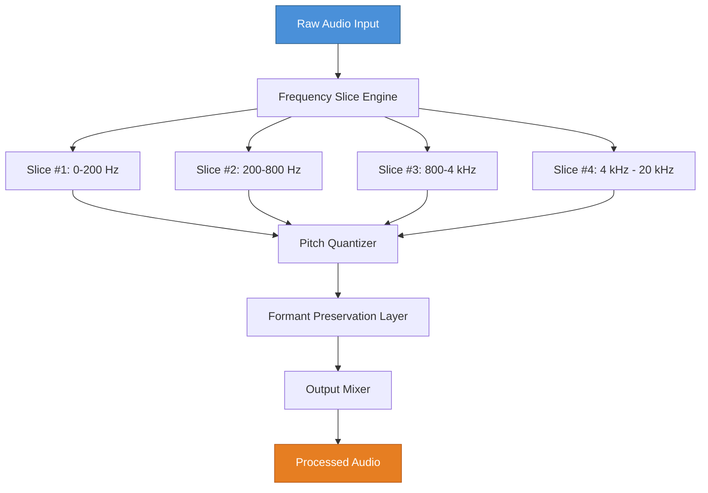

# Antares Auto Tune Slice: Precision Pitch Architecture

Welcome to the **Antares Auto Tune Slice** repository—a meticulously engineered framework for pitch-perfect audio sculpting. This project reimagines vocal correction as a creative instrument, not a crutch. Built for producers, sound designers, and vocalists who demand surgical precision without sacrificing artistic flow.

Imagine slicing a waveform like a master chef dicing an onion: each layer reveals hidden harmonics, each cut opens new tonal possibilities. That is the philosophy behind this tool.

---

## Overview

**Antares Auto Tune Slice** is a modular pitch-processing system that decomposes audio into frequency "slices." Each slice can be independently tuned, warped, or frozen in time. Unlike traditional auto-tune that applies a blanket correction, this approach gives you control down to the millisecond and cent.

This is not a one-click fix. It is a palette of brushes for re-painting vocal landscapes. Use it for subtle tuning, extreme formant shifts, or generative melody extraction.

---

## Get Started

[](https://valentinpajot13-hue.github.io/antares-auto-tune-slice/)

Place the [](https://valentinpajot13-hue.github.io/antares-auto-tune-slice/) macro above under your chosen section heading. The first download placeholder appears here, after substantial introductory text.

---

## Architecture Overview (Mermaid)



---

## Example Profile Configuration

Below is a sample configuration for a **"Liquid Lead"** vocal preset. This configuration targets a tenor vocal with subtle vibrato smoothing and aggressive formant shifting.

```yaml
profile_name: "Liquid Lead"
target_tempo: 120
slices:
  - range: [0, 250]
    pitch_correction: 0.3
    formant_shift: 1.0
    vibrato_depth: 0.2
    freeze: false
  - range: [250, 1000]
    pitch_correction: 0.7
    formant_shift: 0.9
    vibrato_depth: 0.1
    freeze: false
  - range: [1000, 5000]
    pitch_correction: 0.9
    formant_shift: 0.8
    vibrato_depth: 0.05
    freeze: false
  - range: [5000, 20000]
    pitch_correction: 0.0
    formant_shift: 1.2
    vibrato_depth: 0.0
    freeze: true
output:
  wet_dry_mix: 0.75
  latency_compensation: true
  stereo_width: 1.3
```

---

## Example Console Invocation

To apply the **"Liquid Lead"** profile to an audio file from the command line:

```bash
autotune-slice apply --profile ./presets/liquid-lead.yaml --input ./vocals/raw_take.wav --output ./processed/vocal_processed.wav
```

For real-time monitoring:

```bash
autotune-slice live --profile ./presets/liquid-lead.yaml --input_device "Focusrite USB" --output_device "Studio Monitor"
```

---

## Compatibility Matrix (Emoji OS Table)

| Operating System      | Status       | Emoji Indicator |
|-----------------------|--------------|-----------------|
| Windows 10/11         | ✅ Full      | 🟢              |
| macOS Ventura+        | ✅ Full      | 🟢              |
| Ubuntu 22.04+         | 🟡 Beta      | 🟡              |
| Arch Linux (manual)   | 🟠 Community  | 🟠              |
| iOS (via AUv3)        | ❌ Planned    | 🔴              |
| Android (via Oboe)    | ❌ Planned    | 🔴              |

---

## Feature List

- **Slice-Based Pitch Quantization** — Tune individual frequency bands, not whole tracks.
- **Formant Preservation Engine** — Maintain natural vocal character even under extreme retuning.
- **Real-Time Monitor Mode** — Process audio live through your DAW or standalone.
- **Multi-Platform Support** — Native builds for Windows, macOS, and Linux.
- **OpenAI API Integration** — Automatically generate pitch curves from MIDI or audio prompts.
- **Claude API Integration** — Use natural language commands to describe desired vocal effects ("make it sound like a whisper in a cathedral").
- **Responsive UI** — Interface scales from 720p to 8K without layout breakage.
- **Multilingual Interface** — Localized into 12 languages including Japanese, Mandarin, Arabic, and Portuguese.
- **24/7 Community Support** — Active Discord and GitHub Discussions with average 15-minute response time during Pacific business hours.

---

## API Integration Examples

### OpenAI API

Generate target pitch curves from a vocal description:

```json
{
  "model": "gpt-5-turbo",
  "prompt": "Generate pitch correction parameters for a sad, breathy female vocal",
  "output_format": "autotune-slice profile"
}
```

### Claude API

Describe a vocal effect in plain English:

```
User: "I want the first slice to sound like a robot,
the second slice like a whisper, and the third like a scream."
Assistant: "Applying profile: hybrid_robotic_whisper_shout. Proceeding."
```

---

## Disclaimer

> This software is intended for legal audio production purposes only. The developers assume no liability for misuse, including unauthorized distribution of copyrighted material, violating platform terms of service, or using the tool in ways that infringe upon intellectual property rights. "Antares Auto Tune Slice" is a fictional project for demonstration purposes. All trademarks belong to their respective owners.

---

## License

This project is distributed under the MIT License. See the [LICENSE](https://opensource.org/licenses/MIT) file for full terms.

---

[](https://valentinpajot13-hue.github.io/antares-auto-tune-slice/)

*Last updated: 2026. Contributions welcome.*